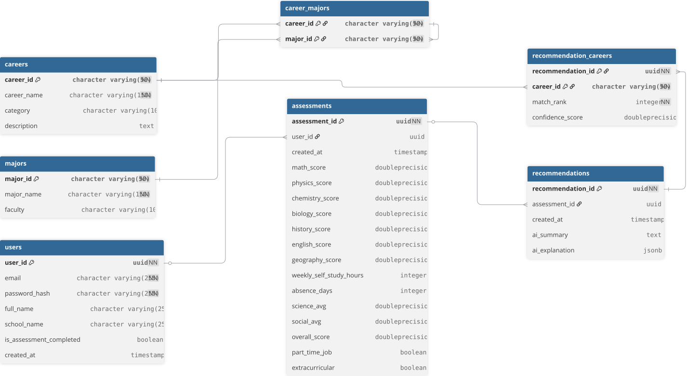

# EduPath Backend API

EduPath adalah platform teknologi pendidikan yang dirancang untuk membantu siswa menemukan jalur karier yang tepat. Sistem ini menganalisis profil akademik dan perilaku belajar siswa, lalu mengintegrasikannya dengan mesin prediksi kecerdasan buatan (AI) untuk menghasilkan rekomendasi karier yang presisi.

Repositori ini memuat layanan _backend_ utama (RESTful API) yang bertugas sebagai orkestrator data antara antarmuka klien (klien UI/UX), basis data utama, dan peladen model AI.

## 🚀 Teknologi Utama

Sistem ini dibangun menggunakan arsitektur modern dan efisien untuk memastikan responsivitas tinggi:

- **Runtime:** Node.js
- **Framework:** Express.js
- **Database Relasional:** PostgreSQL (menyimpan entitas pengguna, asesmen, dan riwayat rekomendasi)
- **In-Memory Cache:** Redis (untuk optimalisasi pengambilan Master Data katalog karier)
- **Autentikasi:** JSON Web Token (JWT)

## 🗄️ Arsitektur Basis Data (ERD)

Struktur basis data dirancang secara relasional untuk memastikan integritas data tanpa redundansi.



_(Catatan: Diagram di atas diekspor langsung dari skema rancangan DBML kami)._

## 📚 Dokumentasi API

Sistem backend ini terbagi menjadi 5 modul API utama:

1. **Authentication Module:** Registrasi dan login pengguna.
2. **User Profile Module:** Manajemen identitas dan data sekolah siswa.
3. **Assessment Module:** Pencatatan skor akademik (Matematika, Fisika, dll) dan metrik perilaku (jam belajar mandiri, absensi).
4. **Recommendation Module (AI Integration):** Penghubung (_proxy_) yang mengirimkan data asesmen ke peladen AI dan mengembalikan probabilitas karier.
5. **Master Data Module:** Katalog referensi statis untuk jalur karier.

**Spesifikasi Teknis Lengkap:**

- Detail kontrak API _request/response_ dapat dibaca pada file [`API-CONTRACT.md`](API-CONTRACT.md).
- Koleksi interaktif Postman beserta simulasi _Mock Environment_ tersedia di dalam folder `docs/postman/`.

## 🛠️ Panduan Instalasi Lokal

Untuk menjalankan peladen pengembangan di mesin lokal, ikuti langkah-langkah berikut:

1. **Kloning Repositori**
   ```bash
   git clone https://github.com/gdekapw17/edupath-backend.git
   cd EduPath-Backend
   ```
2. **Instalasi Dependensi**
   ```bash
   npm install
   ```
3. **Konfigurasi Environment**
   Salin file konfigurasi bawaan dan sesuaikan nilainya dengan kredensial PostgreSQL dan rahasia JWT milikmu.
   ```bash
   cp .env.example .env
   ```
4. **Jalankan Peladen**
   ```bash
   npm run dev
   ```
   Peladen akan berjalan di http://localhost:3000/api/v1.
